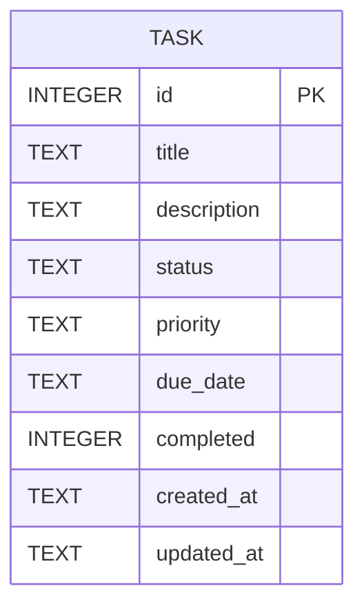

# Database Design

This document describes the `tasks` table used by TaskFlow API, the reasoning
behind each column and constraint, and how the schema evolves over time.

## Why a relational database (SQLite)?

Tasks are simple, well-structured records with a fixed, well-known set of
fields. There are no deeply nested or free-form documents, no need for
horizontal scaling, and no schema-less/evolving structure that would justify a
NoSQL document store. A relational database gives us three things a task
manager needs for free:

- **Schema enforcement at the source of truth.** `NOT NULL` and `CHECK`
  constraints guarantee that invalid data can never be persisted, even if a
  bug in the application layer lets bad input through.
- **ACID transactions.** Every write is atomic and durable, which matters for
  a system whose entire purpose is not losing data.
- **Simple, fast querying** for the filtering, sorting, and pagination the API
  exposes, backed by indexes on the columns that are actually filtered/sorted.

SQLite specifically was kept (per the Project 3 scope) because it requires no
separate database server, stores the entire database in a single file that is
trivial to back up, and is more than fast enough for this workload while
still being fully SQL/ACID compliant.

## Table: `tasks`

| Column        | Type    | Constraints                                                              | Notes |
|---------------|---------|---------------------------------------------------------------------------|-------|
| `id`          | INTEGER | `PRIMARY KEY AUTOINCREMENT`                                               | Unique identifier for every task. Auto-incrementing so IDs are never reused within the table's lifetime. |
| `title`       | TEXT    | `NOT NULL`, `CHECK (length(trim(title)) > 0)`                             | Required. The CHECK constraint rejects `NULL`, empty strings, and whitespace-only strings at the database level, not just in application validation. |
| `description` | TEXT    | none                                                                       | Optional, nullable free-text description. |
| `status`      | TEXT    | `NOT NULL DEFAULT 'pending'`, `CHECK (status IN ('pending','in_progress','completed'))` | Enforces the fixed set of lifecycle states. |
| `priority`    | TEXT    | `NOT NULL DEFAULT 'medium'`, `CHECK (priority IN ('low','medium','high'))` | Enforces the fixed set of priority levels. |
| `due_date`    | TEXT    | none                                                                       | Optional. Stored as an ISO 8601 string (e.g. `2026-08-15T00:00:00.000Z`) or `NULL`. |
| `completed`   | INTEGER | `NOT NULL DEFAULT 0`, `CHECK (completed IN (0, 1))`                        | SQLite has no native boolean type; `0`/`1` is the idiomatic representation, and the CHECK constraint prevents any other integer value from being stored. The API converts this to a real JSON boolean on the way out. |
| `created_at`  | TEXT    | `NOT NULL DEFAULT (strftime('%Y-%m-%dT%H:%M:%fZ','now'))`                 | ISO 8601 UTC timestamp, set once at insert time. |
| `updated_at`  | TEXT    | `NOT NULL DEFAULT (strftime('%Y-%m-%dT%H:%M:%fZ','now'))`                 | ISO 8601 UTC timestamp, kept current by a trigger (see below). |

### Primary key

`id` is the primary key. It is the only column any other part of the system
uses to unambiguously refer to a single task (in URLs, in foreign references,
etc. if the schema ever grows relations).

### NOT NULL constraints

`title`, `status`, `priority`, `completed`, `created_at`, and `updated_at` are
all `NOT NULL`. Only `description` and `due_date` may be absent, since a task
without a description or a due date is still a perfectly valid task.

### CHECK constraints

Four CHECK constraints defend the data even if application-level validation
is ever bypassed, has a bug, or a row is modified directly:

1. `title` must not be empty or whitespace-only (`length(trim(title)) > 0`).
2. `status` must be one of `pending`, `in_progress`, `completed`.
3. `priority` must be one of `low`, `medium`, `high`.
4. `completed` must be `0` or `1` (nothing else).

This means "application validation alone is not sufficient" is backed by an
actual, testable guarantee: `INSERT`/`UPDATE` statements with invalid values
fail with a `SQLITE_CONSTRAINT_CHECK` (or `SQLITE_CONSTRAINT_NOTNULL`) error,
regardless of how the write was issued.

### Indexes

```sql
CREATE INDEX idx_tasks_status    ON tasks (status);
CREATE INDEX idx_tasks_priority  ON tasks (priority);
CREATE INDEX idx_tasks_completed ON tasks (completed);
CREATE INDEX idx_tasks_due_date  ON tasks (due_date);
```

These four columns are exactly the columns the list endpoint filters on
(`status`, `priority`, `completed`) or commonly sorts by (`due_date`), so
indexing them keeps filtered/sorted list queries fast as the table grows. `id`
already has an implicit index as the primary key, and no other column is
queried often enough on its own to justify an index (in particular, `title`
is only ever sorted, not filtered by exact match, so an index there would add
write overhead without a matching read benefit).

### Timestamp handling and the `updated_at` trigger

Both timestamps are stored as ISO 8601 strings in UTC (`strftime('%Y-%m-%dT%H:%M:%fZ', 'now')`),
which sorts correctly as plain text and parses directly with `new Date(...)`
in JavaScript.

`updated_at` is maintained automatically by a trigger rather than by
application code, so it can never drift out of sync with an actual write:

```sql
CREATE TRIGGER trg_tasks_set_updated_at
AFTER UPDATE ON tasks
FOR EACH ROW
WHEN NEW.updated_at IS OLD.updated_at
BEGIN
  UPDATE tasks
  SET updated_at = strftime('%Y-%m-%dT%H:%M:%fZ', 'now')
  WHERE id = NEW.id;
END;
```

The `WHEN NEW.updated_at IS OLD.updated_at` guard is what makes this safe:

- The application's `UPDATE` statements never set `updated_at` themselves, so
  on a normal update `NEW.updated_at` still equals `OLD.updated_at` when the
  trigger fires, and the trigger performs exactly one additional `UPDATE` to
  stamp the new timestamp.
- That second `UPDATE` sets `updated_at` to a *new* value, so if the trigger
  were to fire again for that statement, `NEW.updated_at` would no longer
  equal `OLD.updated_at` and the `WHEN` clause would prevent it from firing a
  third time. Combined with SQLite's default `recursive_triggers = OFF`
  setting, there is no risk of a recursive trigger loop, and the guard also
  means the trigger is a no-op on the rare case where a caller does supply an
  explicit `updated_at` value.

### Status / completed consistency

`status` and `completed` are two different views on the same underlying
fact (whether a task is done), so the API enforces one invariant between
them: `status = 'completed'` if and only if `completed = true`. This is
implemented in the application layer (see `src/utils/reconcileTaskState.js`
and `DATABASE_DESIGN.md`'s sibling doc, `README.md`, for the exact rules),
not as a database CHECK constraint, since SQLite CHECK constraints cannot
express "one column that's a function of another" as flexibly as JavaScript
can, and because a 400 response with a clear error message is a better user
experience than an opaque database constraint violation.

## Entity-Relationship Diagram



There is a single entity in this schema. Project 3's scope is intentionally
limited to CRUD + persistence for one resource type (no user accounts, no
relations to other tables), so there are no foreign keys to diagram.

## Migration strategy

See `ARCHITECTURE.md` for the full migration runner design. In short:

- `migrations/001_create_schema_migrations_table.js` creates a tracking table.
- `migrations/002_create_tasks_table.js` creates the schema above on a fresh
  database (`CREATE TABLE IF NOT EXISTS`, so it never touches an existing
  table).
- `migrations/003_upgrade_legacy_tasks_table.js` detects a pre-Project-3
  `tasks` table (missing `status`/`priority`/`due_date`) and rebuilds it in
  place — copying every existing row across, backfilling `status` from the
  old `completed` flag, defaulting `priority` to `medium`, and leaving
  `due_date` as `NULL` — without ever dropping data.

Both `npm start`/`npm run dev` and `npm run db:migrate` run this same
migration path, so a database file created by an older version of this
project is brought up to date automatically the first time either command
runs against it.
